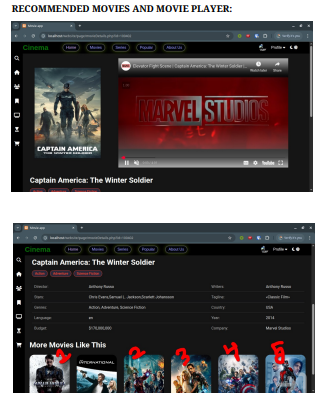
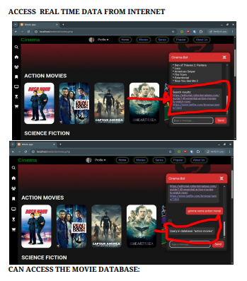
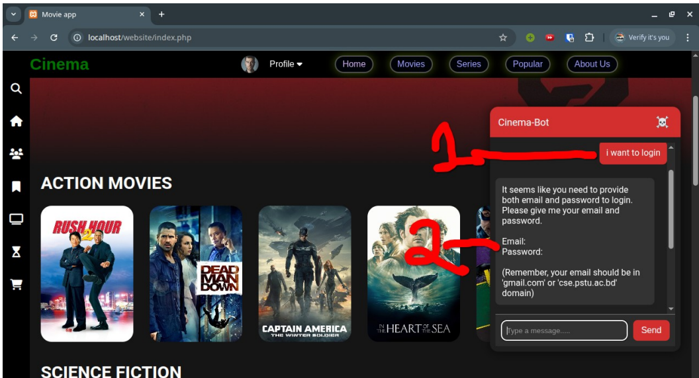
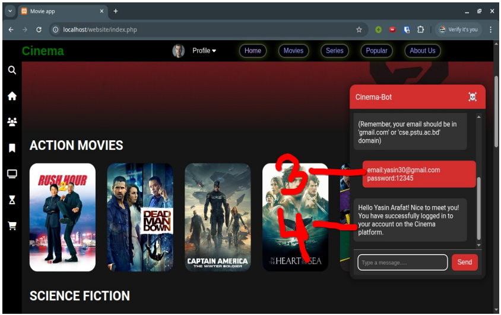
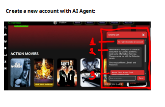
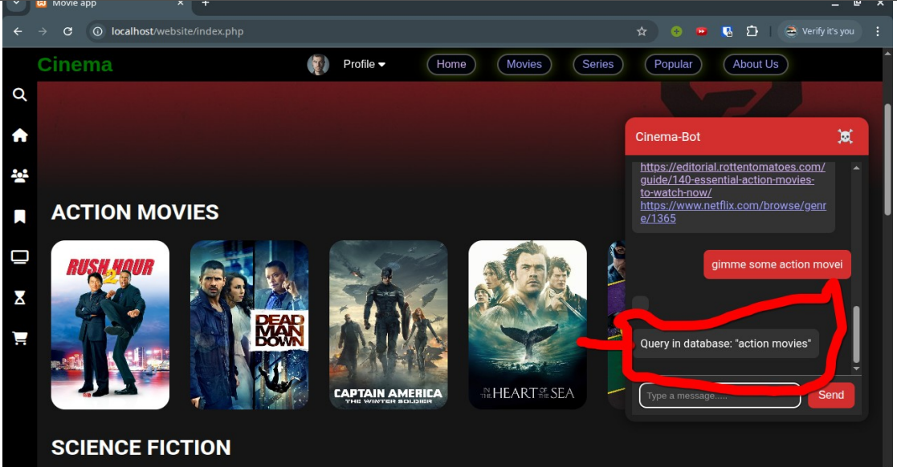
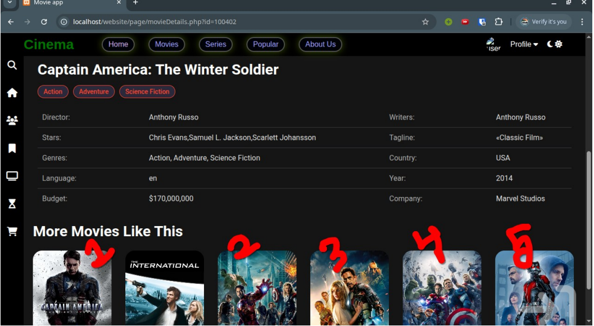

 
 

# `#Cinema: Content based recommendation movie discovery platform with agenti AI.`

 
 

### **Tools And Technique:**
- **Web:**
    - HTML
    - CSS 
    - PHP
    - JavaScript 

- **Recommendation with machine learning and AI Agent:**
    - Python 
        - FASTAPI
        - LANGCHAIN
        - LANGGRAPH 
    
# [backend_code_link](https://github.com/yasin-arafat-05/movie_web_backend_4th)

 
 

# 1. Create a new Account with AI Agent:

 

# 2. GREET MESSAGE AFTER SUCCESSFULLY CREATE AN ACCOUNT 

 

# 3. LOGIN WITH AI AGENT

 

# 4. GREET MESSAGE AFTER SUCCESSFULL LOGIN

 

# 5. ACCESS REALTIME DATA FROM INTERNET 

 

# 6. ACCESS DATA FROM DATABASE 

 

# 7. RECOMMENDED MOVIE

